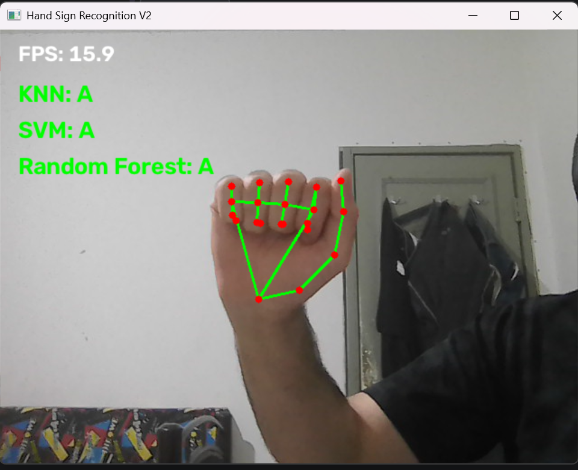
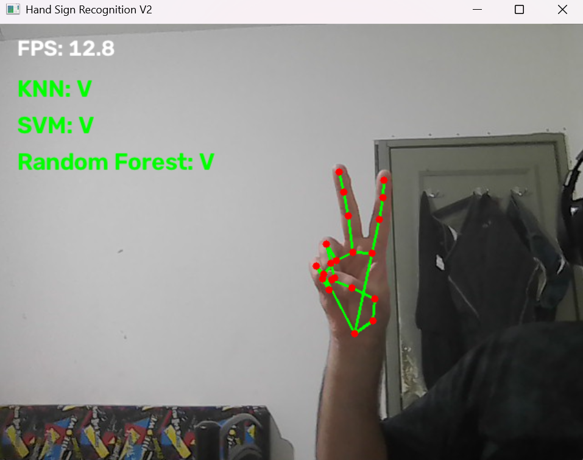
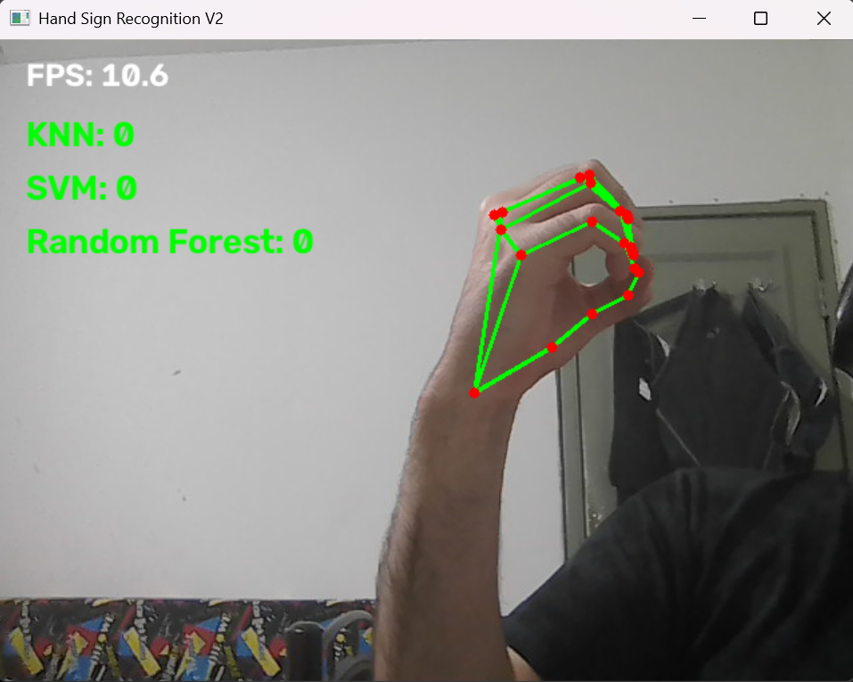

# Hand Sign Recognition V2

Real-time hand-sign recognition using **MediaPipe hand landmarks** and three traditional machine-learning classifiers: **K-Nearest Neighbors (KNN)**, **Support Vector Machine (SVM)**, and **Random Forest**.

The application captures webcam frames, detects a hand, extracts a normalized 63-dimensional landmark feature vector, and displays predictions from all three classifiers side by side. The project includes its own webcam data-collection workflow, model training and evaluation, and saved models for inference without retraining.

> **Project status:** Functional V2 MVP. The reported accuracy figures are **random-frame-split baseline results**, not independently validated accuracy on new recording sessions or new users.

## Features

- Live webcam capture and hand-landmark detection with MediaPipe.
- 21 hand landmarks per detected hand, converted to **63 features** (x, y, z for each landmark).
- Landmark normalization relative to the wrist and hand size, with image-aspect-ratio adjustment.
- Webcam-based collection of labeled training samples into CSV files.
- Training and evaluation of **KNN, SVM, and Random Forest**.
- Saved `.joblib` models for use without retraining.
- Simultaneous predictions from all three models on each processed frame.
- Landmark visualization and per-model predictions.

## Supported signs

The current dataset covers **34 static classes**:

- **24 letters:** `A B C D E F G H I K L M N O P Q R S T U V W X Y`
- **10 digits:** `0 1 2 3 4 5 6 7 8 9`

**J** and **Z** are not supported because their ASL forms involve motion, while this version classifies individual frames. Some static signs are inherently ambiguous: the letter **O** and digit **0** share essentially the same handshape. A single-frame landmark classifier cannot reliably distinguish them without additional information such as alphabet/number mode or context.

## How it works

```text
Webcam frame
    |
    v
MediaPipe HandTracker (21 landmarks)
    |
    v
Normalizer + FeatureExtractor (63 features)
    |
    +----> KNN ------------> predicted sign
    |
    +----> SVM ------------> predicted sign
    |
    +----> Random Forest --> predicted sign
    |
    v
Live OpenCV display: landmarks, 3 predictions, FPS
```

The models are loaded **once** when the application starts. For each frame containing a detected hand, the same feature vector is passed to all three models. Classification is attempted on every processed camera frame, rather than on a fixed timer. The current application classifies the **first detected hand**.

### Feature extraction

Each hand provides 21 `(x, y, z)` landmarks. The feature extractor:

1. Adjusts the vertical coordinate for the image aspect ratio.
2. Subtracts the wrist landmark (landmark 0) to make coordinates wrist-relative.
3. Divides by the distance from the wrist to landmark 9 to normalize hand scale.
4. Flattens the 21 × 3 coordinates into a 63-element feature vector.

The **same preprocessing** is used for collecting data and for live inference. The saved KNN and SVM models include their fitted `StandardScaler` preprocessing within scikit-learn pipelines.

## Dataset

Samples were collected using a webcam and MediaPipe rather than using raw image files for training.

| Dataset property | Value |
|---|---:|
| Classes | 34 |
| Samples per class | 200 |
| Total samples | **6,800** |
| Features per sample | 63 |
| Format | One CSV per class |

Collected samples are stored in `data/collected/`, such as `A.csv` and `0.csv`. Each CSV contains columns `feature_0` through `feature_62`. During collection, hand position, orientation, and finger posture were varied slightly to capture natural variation while preserving the intended sign.

The current dataset was collected from webcam sessions and may contain strongly correlated consecutive frames. It should **not** be considered an independently diverse dataset of users, devices, and environments.

## Model training and baseline results

The training script uses a reproducible **80/20 stratified random split** (`random_state=42`):

- **Training:** 5,440 samples (160 per class)
- **Testing:** 1,360 samples (40 per class)

| Model | Configuration | Baseline test accuracy | Errors / 1,360 |
|---|---|---:|---:|
| KNN | `n_neighbors=5`, `StandardScaler` | **98.46%** | 21 |
| SVM | RBF kernel, `C=10`, `gamma="scale"`, `StandardScaler` | **99.49%** | 7 |
| Random Forest | 200 trees, `random_state=42` | **99.49%** | 7 |

SVM and Random Forest tied on overall accuracy in this baseline, though their mistakes differed. In particular, **O** and **0** warrant attention because their static gestures can be difficult or impossible to distinguish without additional context.

> **Evaluation limitation:** The random split operates on individual frames, so highly similar frames from the same recording session may appear in both training and testing. This can substantially inflate apparent accuracy. These figures describe performance on the current random split only; they are **not** claims of 98–99% accuracy on unseen signers or independent recording sessions. Model selection and tuning should use validation data, with an independent test set held back for final evaluation.

## Project structure

```text
hand-sign-recognition-v2/
├── assets/
│   ├── hand_landmarker.task
│   └── American-Sign-Language-ASL.png
├── data/
│   └── collected/
│       ├── A.csv
│       ├── ...
│       └── 9.csv
├── models/
│   ├── knn.joblib
│   ├── svm.joblib
│   └── random_forest.joblib
├── src/
│   ├── __init__.py
│   ├── camera.py
│   ├── hand_tracker.py
│   ├── normalizer.py
│   ├── feature_extractor.py
│   └── classifier.py
├── training/
│   ├── __init__.py
│   ├── collect_samples.py
│   └── train_model.py
├── tests/
├── main.py
├── requirements.txt
└── README.md
```

### Main components

| File | Purpose |
|---|---|
| `src/camera.py` | Open, read from, and release the webcam |
| `src/hand_tracker.py` | Detect MediaPipe hand landmarks |
| `src/normalizer.py` | Normalize landmark coordinates |
| `src/feature_extractor.py` | Produce 63-feature vectors |
| `src/classifier.py` | Load all three saved models and return predictions |
| `training/collect_samples.py` | Record labeled hand samples into CSV files |
| `training/train_model.py` | Load data, split, train, evaluate, and save classifiers |
| `main.py` | Run live webcam detection and classification |

## Requirements

- Python (developed with **Python 3.12**)
- Webcam
- MediaPipe hand-landmarker task file at `assets/hand_landmarker.task`
- Python dependencies listed in `requirements.txt`

Core libraries include **OpenCV, MediaPipe, NumPy, pandas, scikit-learn, and joblib**.

## Installation

Clone the repository and enter the project directory:

```bash
git clone https://github.com/AdamAS1998/hand-sign-recognition-v2.git
cd hand-sign-recognition-v2
```

Create and activate a virtual environment.

**Windows PowerShell:**

```powershell
python -m venv .venv
.\.venv\Scripts\Activate.ps1
```

**macOS / Linux:**

```bash
python3 -m venv .venv
source .venv/bin/activate
```

Install dependencies:

```bash
python -m pip install -r requirements.txt
```

Ensure the MediaPipe task asset and trained `.joblib` models are present in their respective folders.

## Run real-time recognition

From the project root:

```bash
python main.py
```

The application opens the default webcam (`camera_id=0`) and displays hand landmarks, three model predictions, and the measured FPS.

**Controls:** Press **Q** in the camera window to quit.

If no hand is detected, the application displays a no-hand message rather than a stale prediction. The current implementation uses the first detected hand if multiple hands are present.

**Performance:** Approximately **13 FPS** was observed during one local run with all three models enabled. This is an observation from one setup, not a guaranteed frame rate; camera hardware, resolution, and processing speed will affect performance.

## Recognition screenshots

| Letter A | Letter V | Letter O (predicted as 0) |
|:---:|:---:|:---:|
|  |  |  |

The third example illustrates the **O/0 ambiguity** described in [Supported signs](#supported-signs): all three models predict `0` for an intended `O` handshape.

## Collect additional samples

Run the collection script from the project root, for example:

```bash
python -m training.collect_samples --label A --samples 200 --interval 0.2 --output data/collected
```

- Press **S** to start or pause collection.
- Press **Q** to quit.
- Samples are appended to the corresponding class CSV.

Keep the intended gesture recognizable while varying orientation, distance, and natural finger positioning. Avoid mixing examples of different signs under the same label.

## Retrain models

Run:

```bash
python -m training.train_model
```

This loads the labeled CSV files, performs the stratified split, trains the three classifiers, prints evaluation reports, and saves the models to `models/`.

If the dataset or feature extraction logic changes, **retrain and re-evaluate** the models before using them for live inference. Do not assume previously saved models are compatible with a changed feature format.

## Known limitations and future improvements

The MVP is working, but it recognizes **isolated, static handshapes**, not complete signed words or sentences. The roadmap below separates improvements to the existing classifier from longer-term sequence recognition.

### Near-term improvements

1. **Independent evaluation (highest priority):** Record new sessions on different days and, ideally, from additional consenting signers. Keep entire sessions or signers separate between training and evaluation to avoid near-duplicate-frame leakage.
2. **Resolve inherently ambiguous labels:** **O** (letter) and **0** (digit) can have the same static handshape. Neither more samples nor a different static classifier can reliably infer the intended label from identical landmarks. Add separate **alphabet mode** and **number mode** first; later explore contextual decoding. Evaluate other lookalike signs as well.

### Longer-term roadmap: motion and continuous signing

**Phase 1 — Dynamic (motion-based) signs:** Extend the system beyond single-frame classification by tracking landmarks **across multiple frames**. Start with **J** and **Z**, whose ASL forms involve motion. Collect labeled motion sequences and investigate trajectory-based features. The current three static models cannot recognize movement from one isolated frame.

**Phase 2 — Continuous fingerspelling:** Move from classifying one held sign at a time to recognizing a **stream of letters** as a person fingerspells. 

**Phase 3 — Continuous sign-language recognition:** Explore recognizing **sequences of full signs** and eventually sentences without requiring users to pause between signs. 

## Scope

This is an educational **static hand-sign classification** project. It is **not** a full sign-language translation system: recognizing isolated hand shapes does not cover the movement, facial expression, grammar, and context involved in signed languages.

